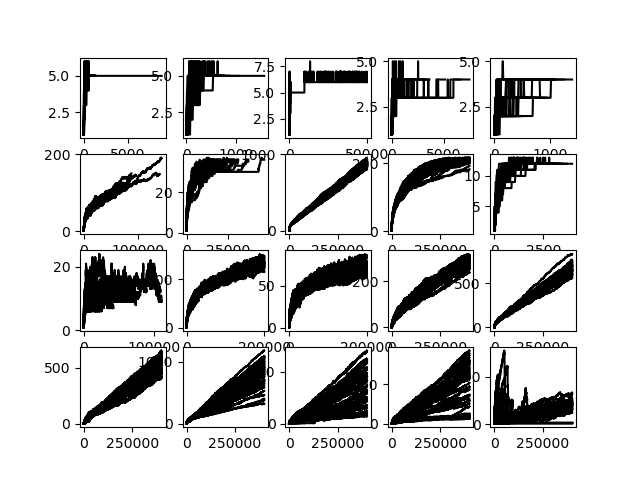

# pynmmso-benchmarking #

Code to use [`pynmmso`](https://github.com/EPCCed/pynmmso/wiki/NMMSO) to run the [Benchmark Functions for CEC’2013 Special
Session and Competition on Niching Methods for Multimodal Function Optimization](http://www.epitropakis.co.uk/sites/default/files/pubs/cec2013-niching-benchmark-tech-report.pdf).  The python implementation
of these functions is taken from https://github.com/mikeagn/CEC2013, although some changes had to be made for Python 3.

This code aims to reproduced the results published in Niching Migratory Multi-Swarm Optimser, described in: “Running Up Those Hills: Multi-Modal Search with the Niching Migratory Multi-Swarm Optimiser” by Jonathan E. Fieldsend published in Proceedings of the IEEE Congress on Evolutionary Computation, pages 2593-2600, 2014 (http://hdl.handle.net/10871/15247)

## How to run ##

The benchmarks were run on Cirrus as a multiprocessor job over 4 CPUs. Walltime was set at 12 hrs in the PBS submission script, but took approximately 7 hrs. A mix of pre- and post-processing was used to generate these results.

## Reproducing tables from Fieldsend et al, 2014 ##

### Table II ###

- 1e-1

|  	| 1 	| 2 	| 3 	| 4 	| 5 	| 6 	| 7 	| 8 	| 9 	| 10 	| 11 	| 12 	| 13 	| 14 	| 15 	| 16 	| 17 	| 18 	| 19 	| 20 	|
|--------	|--------	|--------	|-------	|---------	|-------	|----------	|----------	|-----------	|-----------	|---------	|---------	|----------	|----------	|-----------	|----------	|-----------	|----------	|-----------	|----------	|----------	|
| Mean 	| 661.94 	| 175.36 	| 41.94 	| 1121.62 	| 105.64 	| 43898.62 	| 20867.26 	| 339284.52 	| 378913.28 	| 1295.30 	| 11059.28 	| 67341.60 	| 82296.26 	| 40000.00 	| 400000.0 	| 188060.80 	| 400000.0 	| 67341.60 	| 400000.0 	| 400000.0 	|
| St. D. 	| 1158.02 	| 73.69 	| 42.70 	| 1289.05 	| 70.69 	| 24720.19 	| 7320.69 	| 48911.52 	| 31734.90 	| 457.32 	| 13841.63 	| 60031.81 	| 55253.35	| 0.0 	| 0.0 	| 0.0 	| 0.0 	| 76537.44 	| 0.0 	| 0.0 	|

- 1e-4

|  | 1 | 2 | 3 | 4 | 5 | 6 	| 7 	| 8 	| 9 	| 10 	| 11 	| 12 	| 13 	| 14 	| 15 	| 16 	| 17 	| 18 	| 19 	| 20 	|
|--------	|---------	|--------	|--------	|---------	|--------	|----------	|----------	|-----------	|-----------	|---------	|----------	|----------	|----------	|----------	|----------	|----------	|----------	|----------	|----------	|----------	|
| Mean 	| 1004.58 	| 489.56 	| 246.10 	| 1827.54 	| 483.14 	| 52779.30 	| 24486.66 	| 344929.38 	| 379344.36 	| 2245.88 	| 24119.04 	| 87703.52 	| 101840.44 	| 400000.0 	| 400000.0 	| 400000.0 	| 400000.0 	| 400000.0 	| 400000.0 	| 400000.0 	|
| St. D. 	| 1139.66 	| 188.68 	| 130.98 	| 1336.77 	| 192.99 	| 24999.95 	| 7401.95 	| 50979.92 	| 31797.43 	| 466.33 	| 24224.14 	| 62003.90 	| 66484.53 	| 0.0 	| 0.0 	| 0.0 	| 0.0 	| 0.0 	| 0.0 	| 0.0 	|

### Table III ###

|  	| 1 	| 2 	| 3 	| 4 	| 5 	| 6 	| 7 	| 8 	| 9 	| 10 	| 11 	| 12 	| 13 	| 14 	| 15 	| 16 	| 17 	| 18 	| 19 	| 20 	|
|------	|-----	|-----	|-----	|-----	|-----	|-----	|-----	|------	|------	|-----	|-----	|------	|------	|------	|-----	|-----	|-----	|-----	|-----	|-----	|
| 1e-1 	| 1.0 	| 1.0 	| 1.0 	| 1.0 	| 1.0 	| 1.0 	| 1.0 	| 0.26 	| 0.12 	| 1.0 	| 1.0 	| 0.66 	| 0.0 	| 0.0 	| 0.0 	| 0.0 	| 0.0 	| 0.0 	| 0.0 	| 0.0 	|
| 1e-2 	| 1.0 	| 1.0 	| 1.0 	| 1.0 	| 1.0 	| 1.0 	| 1.0 	| 0.26 	| 0.12 	| 1.0 	| 1.0 	| 0.56 	| 0.08 	| 0.0 	| 0.0 	| 0.0 	| 0.0 	| 0.0 	| 0.0 	| 0.0 	|
| 1e-3 	| 1.0 	| 1.0 	| 1.0 	| 1.0 	| 1.0 	| 1.0 	| 1.0 	| 0.24 	| 0.12 	| 1.0 	| 1.0 	| 0.48 	| 0.08 	| 0.0 	| 0.0 	| 0.0 	| 0.0 	| 0.0 	| 0.0 	| 0.0 	|
| 1e-4 	| 1.0 	| 1.0 	| 1.0 	| 1.0 	| 1.0 	| 1.0 	| 1.0 	| 0.22 	| 0.12 	| 1.0 	| 1.0 	| 0.48 	| 0.08 	| 0.0 	| 0.0 	| 0.0 	| 0.0 	| 0.0 	| 0.0 	| 0.0 	|
| 1e-5 	| 1.0 	| 1.0 	| 1.0 	| 1.0 	| 1.0 	| 1.0 	| 1.0 	| 0.22 	| 0.12 	| 1.0 	| 1.0 	| 0.48 	| 0.08 	| 0.0 	| 0.0 	| 0.0 	| 0.0 	| 0.0 	| 0.0 	| 0.0 	|

### Table IV ###

|  	| 1 	| 2 	| 3 	| 4 	| 5 	| 6 	| 7 	| 8 	| 9 	| 10 	| 11 	| 12 	| 13 	| 14 	| 15 	| 16 	| 17 	| 18 	| 19 	| 20 	|
|------	|-----	|-----	|-----	|-----	|-----	|-----	|-----	|------	|------	|-----	|-----	|--------	|------	|------	|------	|------	|------	|------	|------	|--------	|
| 1e-1 	| 1.0 	| 1.0 	| 1.0 	| 1.0 	| 1.0 	| 1.0 	| 1.0 	| 0.99 	| 0.97 	| 1.0 	| 1.0 	| 0.95 	| 0.85 	| 0.68 	| 0.69 	| 0.66 	| 0.50 	| 0.57 	| 0.19 	| 0.21 	|
| 1e-2 	| 1.0 	| 1.0 	| 1.0 	| 1.0 	| 1.0 	| 1.0 	| 1.0 	| 0.98 	| 0.97 	| 1.0 	| 1.0 	| 0.993 	| 0.80 	| 0.68 	| 0.69 	| 0.66 	| 0.50 	| 0.56 	| 0.17 	| 0.20 	|
| 1e-3 	| 1.0 	| 1.0 	| 1.0 	| 1.0 	| 1.0 	| 1.0 	| 1.0 	| 0.98 	| 0.97 	| 1.0 	| 1.0 	| 0.91 	| 0.78 	| 0.68 	| 0.69 	| 0.66 	| 0.48 	| 0.55 	| 0.15 	| 0.20 	|
| 1e-4 	| 1.0 	| 1.0 	| 1.0 	| 1.0 	| 1.0 	| 1.0 	| 1.0 	| 0.98 	| 0.97 	| 1.0 	| 1.0 	| 0.91 	| 0.78 	| 0.68 	| 0.68 	| 0.65 	| 0.47 	| 0.53 	| 0.12 	| 0.12 	|
| 1e-5 	| 1.0 	| 1.0 	| 1.0 	| 1.0 	| 1.0 	| 1.0 	| 1.0 	| 0.98 	| 0.97 	| 1.0 	| 1.0 	| 0.91 	| 0.78 	| 0.67 	| 0.68 	| 0.64 	| 0.46 	| 0.57 	| 0.11 	| 0.04 	|

### Table V ##

| Median 	| Mean 	| St. D. 	|
|--------	|--------	|--------	|
| 0.979 	| 0.8005 	| 0.2766 	|

### Figure 2 ###

## Some brief comments ##

- in general, most numbers are fairly similar as in Fieldsend's paper, but
  
  - one standard deviation (F1, 1e-1) is an order of magnitude larger than we would expect (one rogue run could be responsible for this though, which the graph seems to support).
  - some convergence rates are up to an order of magnitude different; e.g. 1e-1 F5 convergences more than 3 times quicker with our version, but 1e-1 F7 converges an order of magnitude slower.
  - our version converges where the original doesn't (e.g. 1e-1 F16)

- we get some higher success rates (e.g. at greater accuracies for F8), but values are, in general, very comparable

- Table IV is very similar

- not much difference between the 3 values in Table V

- our Figure 2 is a little different; although many of the general trends are similar (especially e.g. F7, F9, F10), and the y-axis values are ~ equivalent, our runs seem to go on much longer (i.e. runs take longer to get to within 1e-5) - is this a problem?
